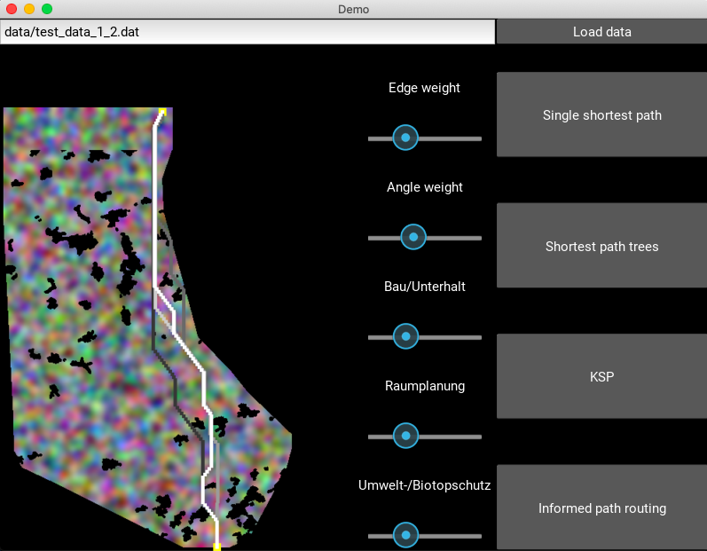
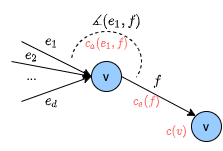

[](https://travis-ci.org/NinaWie/PowerPlanner)


# Optimizing power infrastructure layout



Given resistance costs for a raster of geo locations, the goal is to compute the optimal power line layout from a given start point to a given end point. The approach is to represent raster cells as vertices in a graph, place edges between them based on the minimal and maximal distance of the power towers, and define edge costs based on the underlying cost surface.

## News

This repo contains all code of my master thesis on power infrastructure planning. A much more usable version of the framework is available on [PyPI](https://pypi.org/project/lion-sp/) or in this [repo](https://github.com/NinaWie/lion) as a package called LION. LION provides an interface to all main algorithms and has fewer dependencies (no GUI etc like in this repo). However, this repo here provide more functions than LION, including a GUI, baseline algorithms, visualization functions, etc, so install this repo if you are interested in any of those functions.

## Installation

The library itself has few major dependencies (see [setup.py](setup.py)). 
* `kivy` is required for the GUI
* `numpy` and `matplotlib`

If wanted, create a virtual environment and activate it:

```sh
python3 -m venv env
source env/bin/activate
```

Install the repository in editable mode:

```sh
git clone https://github.com/NinaWie/PowerPlanner
cd PowerPlanner
pip install -e .
```

### Install graph-tool with conda

Unfortunately, there is a major clash between the `kivy` and the `graph-tool` package. `graph-tool` is not used in the angle-constrained shortest path algorithms, but in the baseline algorithms which use a normal Bellman Ford algorithm. If you want to install `graph-tool`, you need `Anaconda` and you can install from the provided yaml file:

```sh
conda env create -f environment.yml
source activate penv
```

Note: If this environment is active, then the UI can not be used as `kivy` is not installed.

## Optimal power infrastructure planning

#### UI

A small python GUI serves as a demo app for the toolbox. Start the UI by running
```sh
python ui.py
```

#### Demo notebook

In the [demo](demo.ipynb) notebook, the most important functions are explained and visualizations show the input data and outputs for each processing step.

#### Codebase

If you want to run one instance without UI, execute 
```sh
python main.py [-h] [-cluster] [-i INSTANCE] [-s SCALE]
```

Optional arguments:
  -h, --help:
  -cluster:
  -i INSTANCE: the id of the instance to use (here one of ch, de, belgium)
  -s SCALE: the resolution: 1 for 10m, 2 for 20m, 5 for 50m resolution

Specify other hyperparameters in the config file of the instance (example will be added soon).

#### Algorithms



Different types of costs are considered and weighted: Angle costs, edge costs (cost for putting a cable above a particular position), and vertex costs (cost to place a pylon).
An algorithm was developed to deal with angle costs, which is not possible with normal shortest path algorithms (e.g. Dijkstra). The code can be found as ```sp_dag``` or ```sp_bf``` dependent whether it is a directed acyclic graph or not, and is implemented in `numba` for efficiency.

## Cite

If you use this code in a publication, please cite the following paper:
```
@article{wiedemann2021optimization,
  title={An Optimization Framework for Power Infrastructure Planning},
  author={Wiedemann, Nina and Adjiashvili, David},
  journal={arXiv preprint arXiv:2101.03388},
  year={2021}
}
```
